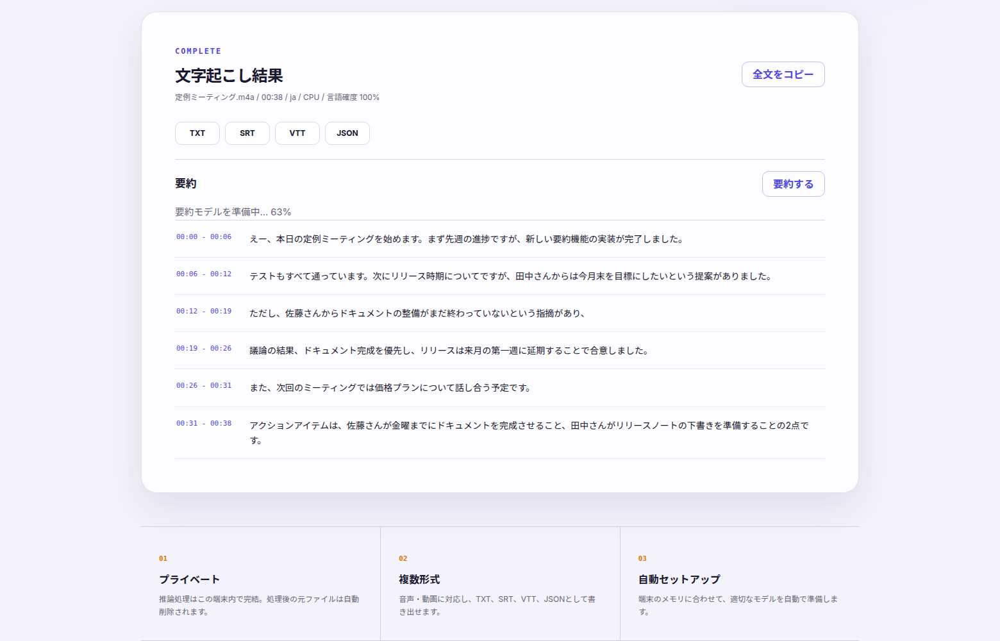

# Local Transcriber（日本語ドキュメント）

> English README: [README.md](README.md)

音声・動画ファイルを `faster-whisper` で文字起こしするWindows / macOSアプリです。
推論は端末内で実行され、外部の文字起こしAPIやAPIキーは必要ありません。

## 主な機能

- 音声・動画ファイルのドラッグ＆ドロップ
- OS・ブラウザの言語に応じた日本語 / English表示と手動切替
- PC/Macのメモリに応じたWhisperモデルの自動選択と初回ダウンロード
- 言語の自動検出
- 無音区間の自動除外
- 処理状況とタイムスタンプ付きセグメントの表示
- TXT / SRT / VTT / JSON形式でダウンロード
- 初回セットアップ後のオフライン利用

## 一般ユーザー向けWindowsアプリ

ポータブル版は次のフォルダーに生成されます。

```text
dist\electron\LocalTranscriber-win32-x64
```

フォルダー全体をZIPで配布し、利用者は展開後に
`LocalTranscriber.exe` をダブルクリックします。Python、Node.js、ffmpegの
インストールは不要です。

初回起動時のみ、PCのメモリに合わせたモデルを自動でダウンロードします。
準備完了後は、ファイルを選んで「文字起こしを開始」を押すだけです。
日本語環境では日本語、その他の環境では英語を初期表示します。画面右上から
いつでも切り替えられ、選択内容は次回起動時にも維持されます。

### English quick start

1. Extract the complete ZIP archive.
2. Double-click `LocalTranscriber.exe`.
3. On the first launch, wait while the app downloads a model selected for the PC.
4. Select or drop an audio/video file, then click **Start transcription**.

Python, Node.js, an API key, and a separate ffmpeg installation are not required.
After the first setup, transcription can run offline.

## 一般ユーザー向けmacOSアプリ

Mac版はDMGとして生成されます。

```text
dist/LocalTranscriber-macOS-<arch>.dmg
```

利用者はDMGを開き、`LocalTranscriber.app` をApplicationsフォルダーへ
ドラッグしてから起動します。Python、Node.js、ffmpegのインストールは不要です。

初回起動時のみ、Macのメモリに合わせたモデルを自動でダウンロードします。
準備完了後は、ファイルを選んで「文字起こしを開始」を押すだけです。
DMGにはMac向けの案内として `START_HERE_MAC.txt` も同梱されます。

### English quick start for macOS

1. Open the DMG file.
2. Drag `LocalTranscriber.app` into Applications.
3. Open Local Transcriber from Applications.
4. On the first launch, wait while the app downloads a model selected for the Mac.
5. Select or drop an audio/video file, then click **Start transcription**.

Python, Node.js, an API key, and a separate ffmpeg installation are not required.
After the first setup, transcription can run offline.

モデルの自動選択基準:

| PC/Macのメモリ | 使用モデル |
| --- | --- |
| 8GB未満 | Tiny |
| 8GB以上 | Base |
| 16GB以上 | Small |
| 32GB以上 | Medium |

モデルはユーザーごとのアプリデータ領域に保存されます。アプリを更新しても、
同じモデルを再ダウンロードする必要はありません。

## アプリアイコン

アプリアイコン素材は `assets/` にあります。

| ファイル | 用途 |
| --- | --- |
| `assets/app-icon.svg` | アイコンの編集用元データ |
| `assets/brand-mark.svg` | マーク単体（透過）の編集用元データ |
| `assets/app-icon.png` | 1024pxマスターPNG（app-icon.svgのレンダリング結果） |
| `assets/brand-mark.png` | 1024pxマーク単体PNG（MSIXタイル・宣伝画像の合成用） |
| `assets/app-icon.icns` | macOSアプリ用 |
| `assets/app-icon.ico` | Windowsアプリ用 |
| `assets/msix/` | Microsoft Store/MSIXのタイル・スプラッシュ画面用 |

SVGを書き換えた場合は、任意のSVGレンダラーで2つのマスターPNGを1024pxで
再レンダリングしてから、派生アセット（ICNS、ICO、MSIX用画像）を再生成します。

```bash
.venv/bin/pip install -e ".[assets]"
.venv/bin/python scripts/generate_app_icons.py
```

## ストア用スクリーンショットと宣伝画像

`store-assets/screenshots/` にja-JP/en-USのスクリーンショット（1920x1080）、
`store-assets/promo/` に宣伝画像（ヒーロー2400x1200、3ステップ1920x1080）があります。

再生成する場合は、アプリを `--port 8765` で起動し、リモートデバッグ有効の
Chrome/Chromiumを使って次を実行します。

```bash
node scripts/capture_store_screenshots.mjs <debug-port> ja store-assets/screenshots/ja-JP
node scripts/capture_store_screenshots.mjs <debug-port> en store-assets/screenshots/en-US
CHROME=/path/to/chrome node scripts/generate_promo_images.mjs
```

## 必要環境

- Windows 10/11、macOS、Linux
- Python 3.10以上
- 初回のモデル取得にインターネット接続
- 空き容量の目安: Smallで約1GB、Large v3で約3GB以上

`faster-whisper` はPyAV経由で音声を読み込むため、通常はシステムに
`ffmpeg` を別途インストールする必要はありません。

## Web版をWindowsで起動

PowerShellまたはコマンドプロンプトで次を実行します。Windowsの
PowerShell実行ポリシーには影響されません。

```bat
run.cmd
```

初回は `.venv` の作成と依存関係のインストールを行います。起動後、
ブラウザで `http://127.0.0.1:8000` を開いてください。

開発時に自動リロードを有効にする場合:

```bat
run.cmd --reload
```

別のポートを使う場合:

```powershell
$env:PORT = "9000"
.\run.cmd
```

## 手動で起動

```powershell
python -m venv .venv
.\.venv\Scripts\python.exe -m pip install -e .
.\.venv\Scripts\python.exe -m uvicorn app.main:app --host 127.0.0.1 --port 8000
```

macOS / Linuxでは仮想環境の有効化だけ読み替えてください。

```bash
source .venv/bin/activate
```

## モデルについて

モデルは初回だけHugging Faceから取得され、以後はローカルから読み込みます。
CUDA対応GPUがある場合は自動的にCUDAを使用します。CUDAランタイムやcuDNNなどが
不足してGPU推論を開始できない場合はCPUへ切り替えます。

完全にローカルのモデルを使う場合は、CTranslate2変換済みの
faster-whisper互換モデルを用意し、環境変数を設定します。

```powershell
$env:WHISPER_LOCAL_MODEL = "C:\models\faster-whisper-small"
.\run.ps1
```

設定後はモデル一覧に `Local` が表示されます。

## 要約機能（オプション）

完了した文字起こしをローカルLLMで要約できます（結果画面の「要約する」ボタン）。
モデルの選定・ダウンロード・共有・更新通知は
[modelshelf](https://github.com/koiyal/modelshelf) に任せており、この端末の
RAM/GPU に合ったチャットモデルが初回に自動で用意されます。モデルは
`~/.modelshelf` の共有ストアに入るため、modelshelf を使う他のアプリと
1つの実体を共有します（重複ダウンロードなし）。

有効化は2ステップです。どちらかが欠けている場合、要約UIは表示されず
アプリは従来どおり動作します。

```console
$ cargo install --git https://github.com/koiyal/modelshelf modelshelf-cli  # または配布バイナリ
$ python -m pip install -e ".[summary]"   # llama-cpp-python を追加
```

- 要約の生成もこの端末内で完結します（外部送信なし）。
- 出力は結果画面に表示されるほか、`SUMMARY.TXT` としてダウンロードできます。
- より良いモデルがカタログに登場すると、要約実行時に案内が表示されます。

**Mac では Apple Intelligence を自動的に第一候補にします**（Apple Silicon +
macOS 26 以降 + Apple Intelligence 有効時）。モデルのダウンロードが一切不要で、
即座に要約できます。非対応の環境では上記の modelshelf + llama-cpp 経路へ自動
フォールバックします。`LT_SUMMARY_ENGINE=apple|local|auto` で強制切替も可能
（ブリッジの実装は `desktop/apple-intelligence-helper/` を参照）。

### どんな挙動になるか

文字起こし完了画面に「要約する」ボタンが現れます。初回だけ、この端末の
RAM/GPU に合った要約モデルの自動セットアップ（ダウンロード）が走り、
ボタンの下に進捗が表示されます。



準備が済むと要約が生成され、結果画面への表示に加えて `SUMMARY.TXT` の
ダウンロードボタンが増えます。2回目以降はセットアップなしで即生成です。


### 手元で試す

上の2ステップ（modelshelf CLI + `.[summary]`）を済ませてから:

```console
$ python -m uvicorn app.main:app --port 8000
```

ブラウザで `http://127.0.0.1:8000` を開き、音声・動画を文字起こしして
「要約する」を押してください。スクリーンショットは
`node scripts/capture_summary_screenshots.mjs <debug-port> ja docs/screenshots`
で再生成できます（ストア用スクリーンショットと同じ CDP 方式）。

## 環境変数

`.env.example` に設定例があります。現状は `.env` の自動読み込みを行わないため、
PowerShellやOSの環境変数として設定してください。

| 変数 | 既定値 | 説明 |
| --- | --- | --- |
| `MAX_UPLOAD_MB` | `2048` | 1ファイルの最大サイズ |
| `WHISPER_DEVICE` | `auto` | `auto` / `cpu` / `cuda` |
| `WHISPER_COMPUTE_TYPE` | `auto` | CPUは`int8`、CUDAは`float16`を自動選択 |
| `WHISPER_LOCAL_MODEL` | 空 | ローカルモデルディレクトリ |
| `WHISPER_MODEL_DIR` | `./data/models` | モデルキャッシュ |
| `TRANSCRIBER_DATA_DIR` | `./data` | アップロード・出力の保存先 |
| `KEEP_UPLOADS` | `false` | 処理後も元ファイルを残す |
| `TRANSCRIBER_WORKERS` | `1` | 同時推論数。GPUメモリに注意 |
| `MODELSHELF_BIN` | 空 | modelshelf バイナリのパス（PATH上にない場合） |
| `LT_SUMMARY_GPU_LAYERS` | `0` | 要約LLMのGPUオフロード層数（`-1`で全層） |
| `LT_SUMMARY_ENGINE` | `auto` | 要約エンジン。`auto`=Apple Intelligence優先 / `apple` / `local` |
| `LT_APPLE_AI_HELPER` | 空 | Apple Intelligence ブリッジのパス（同梱位置以外の場合） |

## データの扱い

- アップロードファイルは `data/uploads` に一時保存します。
- 既定では処理成功・失敗にかかわらず元ファイルを削除します。
- 出力ファイルは `data/outputs/<job-id>` に残ります。
- ジョブ一覧はメモリ上に保持するため、サービス再起動後は画面から過去の出力を
  参照できません。
- インターネットへ公開する認証機能はありません。既定の
  `127.0.0.1` のままローカルで利用してください。

## テスト

```powershell
python -m pip install -e ".[dev]"
python -m pytest
```

## Windowsアプリをビルド

開発マシンにはPython 3.10以上とNode.jsが必要です。

```bat
build-windows.cmd
```

このコマンドは次を実行します。

1. PyInstallerで文字起こしバックエンドをEXE化
2. Electronアプリへバックエンドを同梱
3. `dist\electron\LocalTranscriber-win32-x64` にポータブル版を生成

## MSIXを生成

このプロジェクトはMicrosoftのWindows App Development CLI
（`winapp CLI`）をnpm依存関係として使用します。

Microsoft Store用MSIXの生成には、Partner Centerの
`Product management > Product identity` に表示される値が必要です。

```powershell
$env:STORE_IDENTITY_NAME = "Package/Identity/Nameの値"
$env:STORE_PUBLISHER = "Package/Identity/Publisherの値"
.\package-msix.cmd
```

出力:

```text
dist\KOIYAL-Transcriber-Store.msix
```

署名証明書を使う場合:

```powershell
$env:SIGNING_CERT = "C:\certificates\publisher.pfx"
.\package-msix.cmd
```

署名なしMSIXはMicrosoft Storeへの提出用です。Webサイトなどで直接配布する場合は、
信頼されたコード署名証明書で署名するか、ポータブル版をZIPで配布してください。
Store申請用の入力例と`runFullTrust`の説明文は
`STORE_SUBMISSION.md`を参照してください。

## Macアプリをビルド

Mac版はmacOS上でビルドします。Xcode Command Line Tools、Python 3.10以上、
Node.jsが必要です。

PrivateリポジトリへアクセスできるGitHubアカウントで認証してからcloneします。

```bash
gh auth login
gh repo clone KOIYAL/local-transcriber
cd local-transcriber
```

ビルドを実行します。

```bash
./build-macos.sh
```

`python3` が3.10未満の環境では、対応するPythonを明示できます。

```bash
PYTHON=/opt/homebrew/bin/python3.12 ./build-macos.sh
```

実行中のMacに合わせて、Apple Siliconでは`arm64`、Intel Macでは`x64`版を
生成します。出力先は次のとおりです。

```text
dist/electron/LocalTranscriber-darwin-<arch>/LocalTranscriber.app
dist/LocalTranscriber-macOS-<arch>.dmg
```

DMGには `LocalTranscriber.app`、Applicationsへのショートカット、
`START_HERE_MAC.txt` が含まれます。

一般配布用の署名済みDMGを作る場合は、Apple Developer Programへ登録し、
Developer ID Application証明書と公証用のキーチェーンプロファイルを用意します。

```bash
xcrun notarytool store-credentials "koiyal-notary"
export MAC_CODESIGN_IDENTITY="Developer ID Application: 株式会社KOIYAL (TEAMID)"
export MAC_NOTARY_PROFILE="koiyal-notary"
./build-macos.sh
```

署名情報を設定しない場合は、動作確認用の未署名DMGを生成します。一般ユーザーへ
配布する版はDeveloper IDで署名し、Appleの公証を完了させてください。

Mac App Store版はApp Sandbox、ファイルアクセス権限、同梱バックエンドの署名に
追加対応が必要です。まずはDeveloper IDで署名・公証したDMGによる配布を推奨します。
リリース時の確認項目は `MAC_RELEASE.md` を参照してください。

## API

- `GET /api/health`: 稼働確認
- `GET /api/config`: アップロード設定と初回準備状態
- `GET /api/setup`: 自動モデル準備の開始・状態取得
- `POST /api/jobs`: ファイルをアップロードしてジョブ作成
- `GET /api/jobs/{job_id}`: 状況と結果を取得
- `GET /api/jobs/{job_id}/download/{txt|srt|vtt|json}`: 結果を取得
- `DELETE /api/jobs/{job_id}`: 完了済みジョブと出力を削除

API仕様は起動後の `http://127.0.0.1:8000/docs` でも確認できます。
