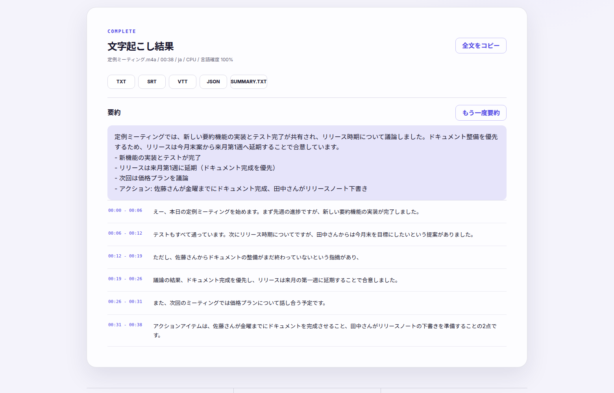

# Local Transcriber

**Private, on-device transcription for Windows and macOS.** Drop in an audio
or video file, get timestamped text — and a local-LLM summary — without
anything leaving your computer. No account, no API key, no cloud.

[](LICENSE)
[](https://github.com/sponsors/KOIYAL)

> 日本語のドキュメントは [README.ja.md](README.ja.md) にあります（ビルド手順・環境変数などの詳細も日本語版が正です）。

## Features

- **Fully local**: transcription (faster-whisper) and summarization run on
  your machine; source files are deleted after processing by default
- **Zero-setup model management**: on first run the app picks a Whisper
  model that fits this computer's memory and downloads it automatically
- **Summaries on completed transcripts**: one click produces a
  same-language summary with key points, exported as `SUMMARY.TXT`
  - on supported Macs this uses **Apple Intelligence** (no download at all)
  - everywhere else, a local LLM chosen for your RAM/GPU by
    [modelshelf](https://github.com/KOIYAL/modelshelf) — shared with any
    other modelshelf-aware app on the machine, so nothing is downloaded twice
- Exports: TXT, SRT, VTT, JSON; bilingual UI (English / 日本語);
  works offline after the first setup



## Get it

- **Download**: free builds are on
  [GitHub Releases](https://github.com/KOIYAL/local-transcriber/releases/latest)
  — a Windows portable zip and a macOS (Apple Silicon) test build. The
  product page is [koiyal.com/tools/local-transcriber](https://koiyal.com/tools/local-transcriber).
- **Run from source** (Python 3.10+):

  ```console
  $ python -m venv .venv && .venv/bin/pip install -e .
  $ .venv/bin/uvicorn app.main:app --port 8000   # open http://127.0.0.1:8000
  ```

  To enable summaries, additionally install the modelshelf CLI and the
  summary extra — see [README.ja.md](README.ja.md#要約機能オプション):

  ```console
  $ cargo install modelshelf-cli   # or a binary from its releases page
  $ .venv/bin/pip install -e ".[summary]"
  ```

- **Desktop builds**: `build-windows.cmd` on Windows,
  `./build-macos.sh` on macOS — or let GitHub Actions build the signed
  macOS app in the cloud ([docs/CLOUD-MAC-BUILD.md](docs/CLOUD-MAC-BUILD.md)).

## How it works

An Electron shell hosts a FastAPI backend (PyInstaller-bundled in desktop
builds). Transcription uses faster-whisper; summaries go through a small
engine layer that prefers Apple's on-device foundation model on supported
Macs and falls back to llama-cpp-python with a modelshelf-provisioned GGUF
model elsewhere.

```
app/           FastAPI backend (jobs, transcription, summarization)
app/static/    single-page UI (vanilla JS, EN/JA)
desktop/       Electron shell, PyInstaller spec, Apple Intelligence helper
docs/          release/build documentation (mostly Japanese)
tests/         pytest suite — no network, no real models needed
```

## Development

```console
$ .venv/bin/pip install -e ".[dev]"
$ .venv/bin/python -m pytest
```

See [CONTRIBUTING.md](CONTRIBUTING.md). Issues and pull requests are
welcome in English or Japanese.

## License

[GNU AGPL-3.0](LICENSE). In short: use it freely, and if you distribute a
modified version (including as a network service), share your changes under
the same license.
